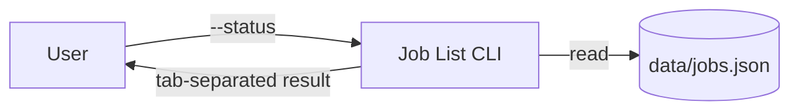

# draw.io 統合ラボ

## 目的

現行コードだけを根拠に、3要素・3フローの編集可能な `docs/architecture.drawio` を作ります。

```text
User -- --status --> Job List CLI -- read --> data/jobs.json
                         |
                         +-- tab-separated result --> User
```

推測した DB、API、認証、AWS サービス、実在の会社名や人物を追加しません。

## 根拠確認

```text
#File app.py #File data/jobs.json #File docs/architecture.md 現行実装だけを根拠に、User、Job List CLI、data/jobs.json の3要素と3フローを表にしてください。まだ変更しないでください。
```

| From | To | Label | 根拠 |
|---|---|---|---|
| User | Job List CLI | `--status` | `main` |
| Job List CLI | `data/jobs.json` | `read` | `load_jobs` |
| Job List CLI | User | `tab-separated result` | `main` |

## Track A: hosted draw.io MCP（推奨）

MCP Servers で `drawio` が `Connected`、tool に `create_diagram` があることを確認します。

```text
#File app.py #File data/jobs.json 現行実装だけを根拠に、User、Job List CLI、data/jobs.json の3要素と、--status、read、tab-separated result の3フローを持つ編集可能な draw.io 図を作成してください。推測したサービスは追加しないでください。drawio MCP の create_diagram を使用してください。コードや既存ファイルは変更しないでください。
```

権限画面で server=`drawio`、tool=`create_diagram` を確認し、1回限りの `Allow` を選びます。図が chat 内に表示されたら内容を確認し、**Open in draw.io** から editor を開きます。

## Track B: Mermaid 手動 import

hosted MCP server が利用できない場合は、Kiro に次の Mermaid を作成させ、draw.io の Mermaid import へ貼り付けます。



Kiro IDE でローカル `@drawio/mcp` Tool Server を任意設定した場合は、`open_drawio_mermaid` で同じ Mermaid を開くこともできます。ただし、このローカル構成は本ハンズオンの対象外です。

## 保存と同期

hosted server の **Open in draw.io** またはローカル Tool Server は図を draw.io editor で開きますが、workspace へ自動保存はしません。次の手順で人が保存先を確認します。

### 1. draw.io から `.drawio` を保存する

1. draw.io で **File > Save As** を選ぶ
2. 保存先として **Device** を選ぶ
3. ファイル名を `architecture.drawio` にする
4. `starter-project/docs/architecture.drawio` へ保存する

ブラウザーが Downloads へ保存した場合は、`starter-project` の root で次を実行します。

Windows PowerShell:

```powershell
Move-Item "$HOME\Downloads\architecture.drawio" ".\docs\architecture.drawio"
```

macOS / Linux:

```bash
mv "$HOME/Downloads/architecture.drawio" "./docs/architecture.drawio"
```

同名ファイルがすでにある場合は、上書き前に内容と保存先を確認します。

### 2. `architecture.md` へ相対リンクを追加する

ファイルが `docs/architecture.drawio` にあることを確認してから、次を Kiro Chat へ送ります。

```text
#File docs/architecture.md docs/architecture.drawio は保存済みです。docs/architecture.md の Overview の直後に `[構成図](architecture.drawio)` という相対リンクを1行だけ追加してください。app.py、data、tests、図ファイル、ほかの記述は変更しないでください。
```

期待する Markdown:

```markdown
[構成図](architecture.drawio)
```

### 3. 保存結果を確認する

1. `docs/architecture.md` のリンクを開き、`docs/architecture.drawio` を参照することを確認する
2. draw.io を閉じ、`docs/architecture.drawio` を再度開いて編集可能であることを確認する
3. `#Git Diff` で、追加対象が図ファイルと Markdown の相対リンクだけであることを確認する

## 検証

### Windows

```powershell
py -3.12 -m unittest discover -s tests -v
py -3.12 scripts/validate_docs.py
```

### macOS / Linux

```bash
python3 -m unittest discover -s tests -v
python3 scripts/validate_docs.py
```

`#Git Diff` で、図と Markdown 以外のコード変更がないこと、3要素・3フローが `app.py` と一致することを確認します。

## 発展情報: Power で再利用する（本ハンズオンの対象外）

!!! info "このハンズオンでは実施しません"
    ここでは Power の考え方だけを紹介します。本ハンズオン中に Power のインストール、作成、設定、動作確認は行いません。興味がある方が、演習後に試すための参考情報です。

### Power とは

Power は、特定の技術を扱うためのツール、作業手順、ベストプラクティスを1つにまとめた、Kiro のインストール可能な拡張パッケージです。会話の内容が登録されたキーワードに一致すると、必要な Power が有効になり、関連する知識やツールが読み込まれます。

| 機能 | 役割 |
|---|---|
| MCP | Kiro に draw.io を操作する機能を提供する |
| Skill | 図を作る手順や確認方法を Kiro に伝える |
| Power | MCP、Skill、関連する設定を1つにまとめて必要なときだけ有効にする |

### draw.io Power にまとめられる内容

今回の作業を実務で繰り返す場合は、次の内容を Power としてまとめられます。

1. 根拠にするコードとドキュメントを確認する
2. 推測したサービスを図へ追加しない
3. Mermaid を生成する
4. 公式 `@drawio/mcp` の `open_drawio_mermaid` を呼び出す
5. `.drawio` ファイルの保存先を確認する
6. Markdown に相対リンクを追加する
7. コード、図、Git Diff の整合性を確認する

Power を作る場合も、draw.io を操作する機能そのものは公式 hosted server または `@drawio/mcp` を利用します。独自 MCP server を作り直す必要はありません。

### 演習後に試したい場合

- [Kiro Powers の概要](https://kiro.dev/docs/powers/)
- [Power をインストールする](https://kiro.dev/docs/powers/installation/)
- [Power を作成する](https://kiro.dev/docs/powers/create/)

Kiro IDE の Powers 画面または Kiro Powers catalog から既存の Power を確認できます。インストール前に、含まれる Skill、MCP 設定、要求される権限を確認してください。
