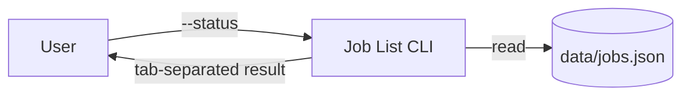

# draw.io 統合ラボ

## 目的

現行コードだけを根拠に、3要素・3フローの編集可能な `docs/architecture.drawio` を作ります。

```text
User -- --status --> Job List CLI -- read --> data/jobs.json
                         |
                         +-- tab-separated result --> User
```

推測した DB、API、認証、AWS サービス、実在の会社名や人物を追加しません。

## 根拠確認

```text
#File app.py #File data/jobs.json #File docs/architecture.md 現行実装だけを根拠に、User、Job List CLI、data/jobs.json の3要素と3フローを表にしてください。まだ変更しないでください。
```

| From | To | Label | 根拠 |
|---|---|---|---|
| User | Job List CLI | `--status` | `main` |
| Job List CLI | `data/jobs.json` | `read` | `load_jobs` |
| Job List CLI | User | `tab-separated result` | `main` |

## Track A: 公式 `@drawio/mcp`

MCP Servers で `drawio` が Connected、tool が `open_drawio_mermaid` であることを確認します。5分以上かかる場合は Track B へ切り替えます。

```text
#File app.py #File data/jobs.json 現行実装だけを根拠に Mermaid flowchart LR を作り、drawio MCP の open_drawio_mermaid で開いてください。要素は User、Job List CLI、data/jobs.json の3つだけです。矢印は --status、read、tab-separated result の3本です。コードや既存ファイルを変更しないでください。
```

権限画面で server=`drawio`、tool=`open_drawio_mermaid` を確認し、1回限りの Allow を選びます。

## Track B: Mermaid fallback



これを draw.io の Mermaid import へ貼り付けるか、同じ3要素を手作業で再現します。

## 保存と同期

`open_drawio_mermaid` は図を draw.io のブラウザー画面で開きますが、workspace へ自動保存はしません。次の手順で人が保存先を確認します。

### 1. draw.io から `.drawio` を保存する

1. draw.io で **File > Save As** を選ぶ
2. 保存先として **Device** を選ぶ
3. ファイル名を `architecture.drawio` にする
4. `starter-project/docs/architecture.drawio` へ保存する

ブラウザーが Downloads へ保存した場合は、`starter-project` の root で次を実行します。

Windows PowerShell:

```powershell
Move-Item "$HOME\Downloads\architecture.drawio" ".\docs\architecture.drawio"
```

macOS / Linux:

```bash
mv "$HOME/Downloads/architecture.drawio" "./docs/architecture.drawio"
```

同名ファイルがすでにある場合は、上書き前に内容と保存先を確認します。

### 2. `architecture.md` へ相対リンクを追加する

ファイルが `docs/architecture.drawio` にあることを確認してから、次を Kiro Chat へ送ります。

```text
#File docs/architecture.md docs/architecture.drawio は保存済みです。docs/architecture.md の Overview の直後に `[構成図](architecture.drawio)` という相対リンクを1行だけ追加してください。app.py、data、tests、図ファイル、ほかの記述は変更しないでください。
```

期待する Markdown:

```markdown
[構成図](architecture.drawio)
```

### 3. 保存結果を確認する

1. `docs/architecture.md` のリンクを開き、`docs/architecture.drawio` を参照することを確認する
2. draw.io を閉じ、`docs/architecture.drawio` を再度開いて編集可能であることを確認する
3. `#Git Diff` で、追加対象が図ファイルと Markdown の相対リンクだけであることを確認する

## 検証

### Windows

```powershell
py -3.12 -m unittest discover -s tests -v
py -3.12 scripts/validate_docs.py
```

### macOS / Linux

```bash
python3 -m unittest discover -s tests -v
python3 scripts/validate_docs.py
```

`#Git Diff` で、図と Markdown 以外のコード変更がないこと、3要素・3フローが `app.py` と一致することを確認します。
